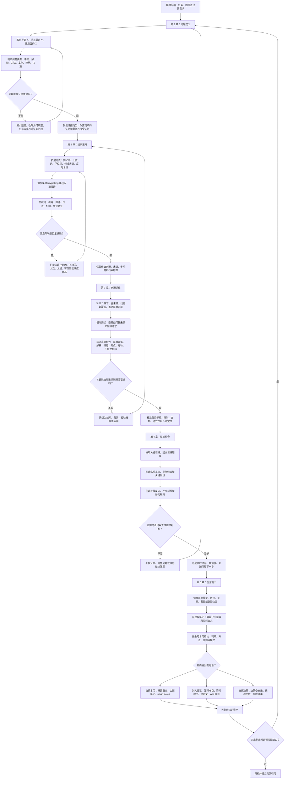
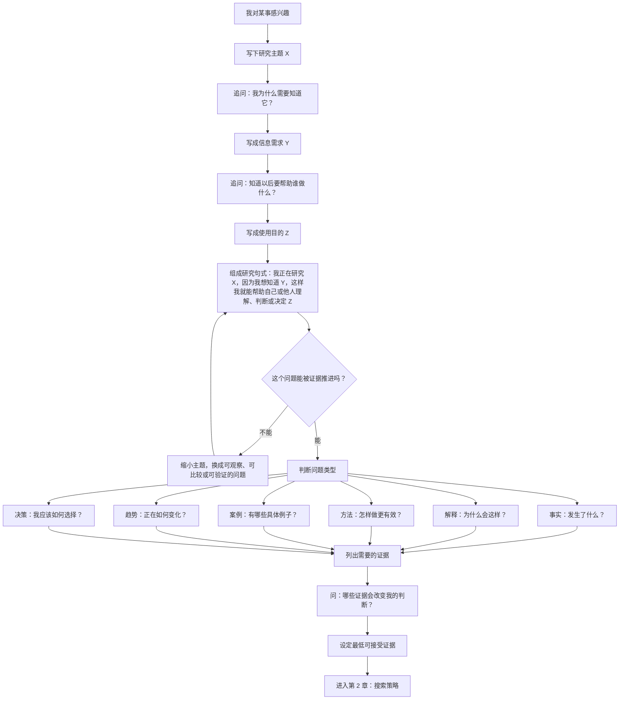
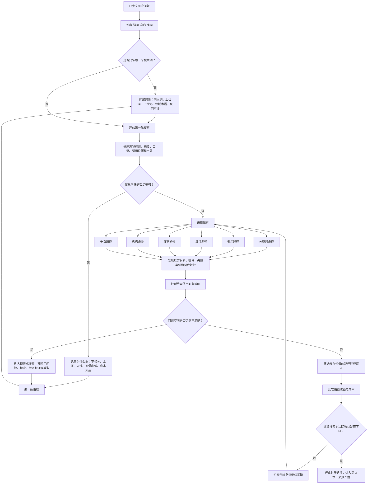
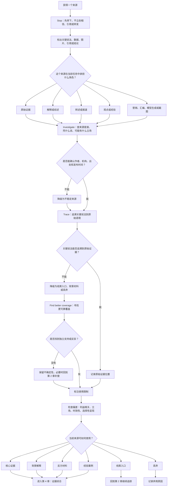
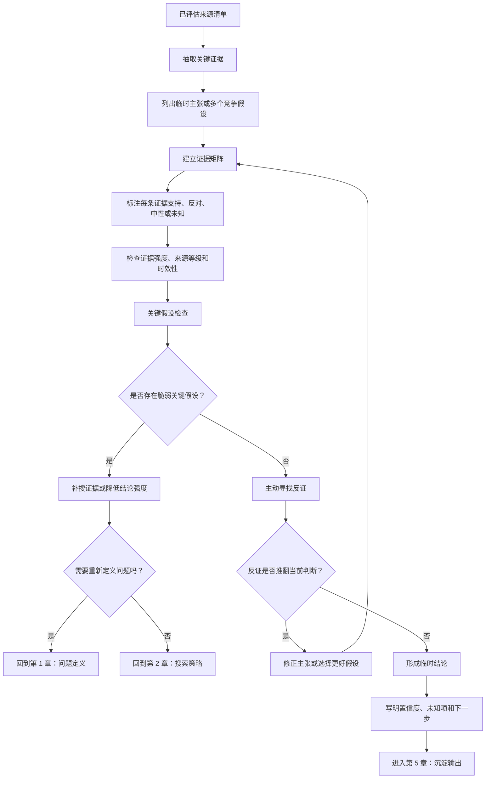
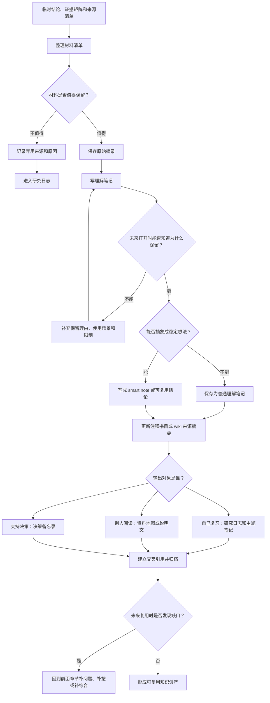

# 通用信息搜集流程

> dev-orchestrator 接线：本文件是 `research` 类型任务的**执行方法论**——派发差异要求与验收门见 `task-spec-research.md`，执行会话按五层流程跑调研。赶时间只读「通用工作流速记」+ 各章「执行检查句」。

这份文档是《通用信息搜集方法论资料地图》的执行版。资料地图回答“哪些理论、书籍和方法属于哪一层”，本文回答“真实开始搜集信息时，怎样从一个模糊兴趣一步步走到可审查、可复用、可输出的判断”。

核心链条是：

```text
问题定义 -> 搜索策略 -> 来源评估 -> 证据综合 -> 沉淀输出
```

这五步不是单向瀑布，而是一个带回退的判断循环。来源评估发现关键说法无法追溯，就回到搜索策略；证据综合发现关键假设站不住，就回到问题定义或补搜；沉淀输出时发现未来无法复用，就回到证据综合补全证据关系。

## 继承的基线原则

本流程继承知识库实践中的三个可迁移基线：

- 面向问题的来源支撑综合（source-backed synthesis），而不是无边界摘录。
- 按问题选择方法：探索性访谈、情境调查、日记研究、无主持测试和洞察仓库各自回答不同问题，方法不能替代问题。
- 把资料选择、证据强度和后续知识沉淀分开：研究型来源、实践型来源和笔记工作流不应混成同一种证据。

本文继承这些原则：先明确问题，再选择搜集路径；先标注来源强度，再综合判断；先保留出处和关系，再沉淀为长期知识。

## 如何使用本文

小问题不需要完整表格，可以每章只写一两行。大问题、决策问题、长文研究、竞品研究、技术选型和陌生领域学习，则应该完整走一遍五层流程。

每章都按同一结构展开：

- 本章在总流程中的位置。
- 输入、动作、输出和回退条件。
- 本章依赖的核心方法论。
- 可执行流程图。
- 检查句和最小模板。
- 进入下一章前的交接物。

最低可行用法是：

1. 在第 1 章把兴趣改写成可被证据推进的问题。
2. 在第 2 章至少打开两条搜索路径。
3. 在第 3 章用 `SIFT` 追溯关键说法。
4. 在第 4 章用证据矩阵形成临时判断。
5. 在第 5 章把来源、判断、限制和下一步沉淀下来。

## 总流程图



## 五层流程总表

| 阶段 | 输入 | 核心动作 | 输出 | 回退条件 |
| --- | --- | --- | --- | --- |
| 问题定义 | 兴趣、任务、困惑、决策需求 | 主题收束、研究问题、证据需求、用途定义 | 可被证据推进的问题 | 问题过大、不可观察、无法判断证据是否足够 |
| 搜索策略 | 已定义问题和证据需求 | 扩展词表，沿关键词、引用、脚注、作者、机构、争议路径采摘 | 候选来源和线索地图 | 信息气味弱、路径成本过高、只找到重复材料 |
| 来源评估 | 候选来源 | `SIFT`、横向阅读、原始语境追溯、来源降级 | 可使用、降级使用或丢弃的来源清单 | 关键说法无法追溯、来源利益冲突大、缺少独立支持 |
| 证据综合 | 已评估来源 | 证据矩阵、竞争假设、关键假设检查、反证搜索 | 临时判断、置信度、未知项 | 证据只支持单一立场、关键假设脆弱、反证未处理 |
| 沉淀输出 | 临时判断和证据链 | 原始摘录、理解笔记、可复用结论、最终报告 | 研究日志、注释书目、资料地图、决策备忘录、wiki 条目 | 未来无法复用、缺少出处、只有摘录没有理解 |

## 第 1 章：问题定义

### 1.1 本章在总流程中的位置

信息搜集的第一步不是输入关键词，而是把“我对某事感兴趣”改写成：

> 我需要回答什么问题？什么证据会改变我的判断？

没有完成问题定义，后面的搜索会变成无边界浏览：看起来资料很多，但不知道哪些材料能改变判断，也不知道什么时候可以停止。

本章的交接物是一个可被证据推进的问题，以及它对应的证据需求。

### 1.2 输入、动作、输出和回退

| 项目 | 内容 |
| --- | --- |
| 输入 | 原始兴趣、任务、困惑、决策需求、他人的问题 |
| 核心动作 | 写出主题 `X`、信息需求 `Y`、使用目的 `Z`；判断问题类型；列出会改变判断的证据 |
| 输出 | 可回答的问题、证据类型、最低可接受证据 |
| 回退条件 | 问题不可观察、范围太大、无法判断什么证据算足够、用途不清楚 |
| 下一章入口 | 带着证据需求进入搜索策略，而不是只带着关键词进入搜索引擎 |

### 1.3 核心方法论

《The Craft of Research》适合放在这一层。它的核心价值不是教人查资料，而是教人把主题转成问题，把问题转成主张，再把主张转成证据需求。

通用句式：

```text
我正在研究 X。
因为我想知道 Y。
这样我就能帮助自己或他人理解、判断或决定 Z。
```

Kuhlthau 的 `Information Search Process` 提醒我们：搜索早期的不确定、混乱和焦虑不是异常，而是信息搜集的一部分。过早要求自己“马上找到答案”，反而容易把第一个看起来清楚的来源误认为结论。

Wilson 的信息行为模型可以帮助区分四件事：

- 信息需求：为什么需要知道。
- 信息搜寻：为了满足需求而采取的整体行动。
- 信息搜索：在具体系统里输入查询、浏览结果、追踪链接。
- 信息使用：资料如何进入判断、行动、写作或决策。

这四件事的顺序很重要：先有信息需求，再设计信息搜寻；具体搜索只是其中的一种动作；最后还要回到信息使用。

### 1.4 问题定义流程图



### 1.5 最小操作模板

```text
兴趣：
我对 ______ 感兴趣。

主题 X：
我正在研究 ______。

信息需求 Y：
因为我想知道 ______。

使用目的 Z：
这样我就能帮助 ______ 理解、判断或决定 ______。

可被证据推进的问题：
我需要回答：______？

问题类型：
事实 / 解释 / 方法 / 案例 / 趋势 / 决策

会改变判断的证据：
如果我找到 ______，我会改变原来的判断。

最低可接受证据：
即使找不到完美资料，至少需要 ______。
```

### 1.6 执行检查句

1. 我真正要回答的问题是什么？
2. 这个问题是否可以被证据推进？
3. 哪些证据会改变我的判断？
4. 我是在寻找事实、解释、方法、案例、趋势，还是决策依据？
5. 如果找不到完美资料，最低可接受证据是什么？

### 1.7 常见误区

- 把搜索词当成研究问题。搜索词只是入口，问题才决定证据需求。
- 把“我想了解一下”当成足够清楚的问题。它还没有说明用途和证据标准。
- 过早要求自己形成结论。开放问题早期的不确定是正常阶段，不是失败。
- 没有写出最低可接受证据，导致永远不知道该继续搜还是停止。

### 1.8 进入下一章前的交接物

进入搜索策略前，至少要留下：

- 一句话问题。
- 问题类型。
- 会改变判断的证据。
- 最低可接受证据。
- 初始关键词和可能的证据类型。

## 第 2 章：搜索策略

### 2.1 本章在总流程中的位置

完成问题定义后，下一步不是反复打磨一个完美搜索词，而是为问题打开多条可追踪的线索路径。

搜索策略层回答：

- 去哪里找？
- 沿哪些线索找？
- 什么时候换路径？
- 什么时候停止扩展路径，转入来源评估？

本章的交接物是候选来源、扩展词表、线索地图和搜索路径记录。

### 2.2 输入、动作、输出和回退

| 项目 | 内容 |
| --- | --- |
| 输入 | 已定义问题、证据需求、初始关键词、最低可接受证据 |
| 核心动作 | 扩展词表；追踪关键词、引用、脚注、作者、机构、争议路径；判断信息气味 |
| 输出 | 候选来源、线索地图、新术语、新子问题、路径记录 |
| 回退条件 | 只依赖一个搜索词、路径信息气味弱、材料重复、成本过高、问题空间仍不清楚 |
| 下一章入口 | 把候选来源送入来源评估，而不是直接把搜索结果当证据 |

### 2.3 核心方法论

Bates 的 `Berrypicking` 模型非常关键。真实搜索常常不是一次查询得到完整结果，而是不断沿着线索采摘：从一篇文章的脚注跳到另一篇，从一个作者跳到他的同事，从一个概念跳到同义词，从一个数据库跳到另一个领域目录。

Pirolli 与 Card 的 `Information Foraging` 把搜索看成收益与成本之间的选择。好的搜索者不是读完所有材料，而是不断判断“这条路径的信息气味是否足够强”。信息气味可以来自标题、摘要、引用位置、作者可信度、出处、术语密度和与当前问题的贴合度。

Marchionini 的探索式搜索适合问题空间还不清楚的阶段。此时目标不是立刻找到一个答案，而是理解有哪些子问题、哪些概念、哪些学派、哪些证据类型。

常用线索路径：

- 关键词路径：同义词、上位词、下位词、领域术语、反向术语。
- 引用路径：谁引用了这篇资料，这篇资料又引用了谁。
- 脚注路径：教材、综述、报告里的脚注和参考文献。
- 作者路径：作者主页、研究团队、长期主题、合作网络。
- 机构路径：大学、政府、标准组织、行业协会、实验室。
- 争议路径：寻找反方、批评、失败案例和替代解释。

### 2.4 搜索策略流程图



### 2.5 搜索路径记录模板

```text
当前研究问题：
我需要回答：______？

当前关键词：
______

扩展词表：
- 同义词：______
- 上位词：______
- 下位词：______
- 领域术语：______
- 反向术语：______

本轮采摘路径：
- 关键词路径：______
- 引用路径：______
- 脚注路径：______
- 作者路径：______
- 机构路径：______
- 争议路径：______

信息气味判断：
这条路径值得继续，因为 ______。
这条路径应该暂停，因为 ______。

新发现的问题地图：
- 新子问题：______
- 新概念：______
- 新学派或立场：______
- 新证据类型：______

停止或继续：
我应该继续搜索，因为 ______。
我应该停止扩展路径，因为 ______。
```

### 2.6 执行检查句

1. 我是否只用了一个搜索词？
2. 我是否追踪了至少一条引用链或脚注链？
3. 我是否找过作者、机构或标准组织入口？
4. 我是否主动寻找反对材料？
5. 我是否知道继续搜下去的边际收益正在下降？

### 2.7 常见误区

- 把高排名结果当成高质量来源。搜索排名和证据质量不是一回事。
- 只优化关键词，不扩展路径。
- 只找支持当前看法的材料，把搜集变成立场辩护。
- 过早沉迷工具。工具能扩大覆盖面，但不能替代问题定义和来源评估。
- 不记录弱路径，导致之后重复走同样的低收益路线。

### 2.8 进入下一章前的交接物

进入来源评估前，至少要留下：

- 候选来源清单。
- 每个来源来自哪条路径。
- 路径的信息气味判断。
- 新发现的术语、子问题、学派或争议。
- 已经暂停或丢弃的搜索路径及原因。

## 第 3 章：来源评估

### 3.1 本章在总流程中的位置

搜索策略产生的是候选来源，不是最终证据。来源评估层回答三个问题：

- 这个来源可以怎样使用？
- 它应该降级到什么程度？
- 它是否需要被丢弃？

本章的交接物是已评估来源清单：每个来源都要有角色、使用等级、限制、可信度理由和关键说法追溯结果。

### 3.2 输入、动作、输出和回退

| 项目 | 内容 |
| --- | --- |
| 输入 | 候选来源、关键说法、搜索路径记录 |
| 核心动作 | `SIFT`、横向阅读、查作者机构、找更好覆盖、追溯关键说法到原始语境 |
| 输出 | 来源等级、使用等级、降级理由、可用证据、弃用来源 |
| 回退条件 | 关键说法无法追溯、来源身份不清、缺少独立覆盖、时效性不满足当前问题 |
| 下一章入口 | 只有经过评估和标注的来源，才进入证据综合 |

### 3.3 核心方法论

`SIFT` 是通用场景里最实用的轻量方法：

- Stop：先停下，不要立刻相信或转发。
- Investigate the source：查来源是谁、凭什么说、可能有什么立场。
- Find better coverage：找更好的覆盖，而不是只盯着眼前页面。
- Trace claims：追溯关键说法、引用和图片到原始语境。

横向阅读是 `SIFT` 的操作方式之一。不要只在一个页面内部寻找可信信号，而要打开新的页面查这个来源如何被其他可靠来源描述。

来源可以按使用等级处理：

- 原始来源：论文、数据、标准、官方文档、原始访谈、原始报告。
- 高质量二手来源：系统综述、教材、大学课程、专业手册。
- 普通二手来源：新闻、博客、播客、行业文章。
- 经验来源：论坛、社交媒体、个人心得、案例复盘。
- 不稳定来源：营销材料、无出处汇编、模型生成文本、无法追溯的截图。

Heuer 的《Psychology of Intelligence Analysis》提醒我们：人在面对不完整、模糊、冲突信息时，容易被已有印象、可得性、锚定和确认偏误影响。来源评估不只是判断别人是否可靠，也是在控制自己的解释偏差。

### 3.4 来源评估流程图



### 3.5 来源评估模板

```text
当前来源：
______

关键说法：
______

来源角色：
原始证据 / 解释或综述 / 转述或报道 / 观点或经验 / 不稳定材料

SIFT 检查：
- Stop：我是否已经暂停直接相信或转发？______
- Investigate：作者、机构、出处、立场是什么？______
- Find better coverage：是否有更好的覆盖？______
- Trace claims：关键说法最早来自哪里？______

横向阅读结果：
其他可靠来源如何描述这个来源或说法？______

使用等级：
核心证据 / 背景解释 / 线索入口 / 反方材料 / 经验案例 / 丢弃

降级理由：
这个来源需要降级，因为 ______。

时效性判断：
这个资料是否可能过时？为什么？______

偏差检查：
我是否可能因为已有印象、可得性、锚定或确认偏误而高估它？______
```

### 3.6 执行检查句

1. 这个说法最早来自哪里？
2. 当前来源是原始证据、解释、转述，还是观点？
3. 这个来源是否有利益相关方或明显立场？
4. 这个资料的时效性是否重要？
5. 我能否找到独立来源支持或反驳它？

### 3.7 常见误区

- 把实践心得当成研究结论。经验材料有价值，但需要标注适用边界。
- 只在来源页面内部找可信信号，不做横向阅读。
- 能找到出处就以为等于可信。出处还要看证据角色、方法、时效和限制。
- 不记录弃用来源和反证，导致未来重复踩坑，也无法解释判断边界。
- 把模型生成文本、截图、无出处汇编当作稳定证据。

### 3.8 进入下一章前的交接物

进入证据综合前，至少要留下：

- 已评估来源清单。
- 每个来源的角色和使用等级。
- 关键说法的原始语境位置。
- 降级或弃用理由。
- 独立支持、反驳或仍然未知的部分。

## 第 4 章：证据综合

### 4.1 本章在总流程中的位置

资料多不等于判断清楚。证据综合层负责把已评估来源放进同一个解释结构里，回答：

- 哪些证据支持当前判断？
- 哪些证据反对当前判断？
- 有没有更好的竞争解释？
- 哪些关键假设最脆弱？
- 结论应该给多高置信度？

本章的交接物是临时判断、证据矩阵、竞争假设、关键假设、反证、未知项和置信度。

### 4.2 输入、动作、输出和回退

| 项目 | 内容 |
| --- | --- |
| 输入 | 已评估来源清单、关键说法、来源等级、降级理由 |
| 核心动作 | 抽取证据；建立证据矩阵；列出竞争假设；检查关键假设；主动寻找反证；写置信度 |
| 输出 | 临时结论、置信度、未知项、下一步 |
| 回退条件 | 证据不足、关键假设脆弱、只有支持材料、反证未处理、结论超过证据强度 |
| 下一章入口 | 只有带证据链、限制和置信度的判断，才进入沉淀输出 |

### 4.3 核心方法论

Pirolli 与 Card 的分析员 `Sensemaking` 模型适合这一层。它把分析活动拆成两个相互影响的循环：

- 觅食和过滤：搜集、筛选、聚类、保留可用材料。
- 建模和解释：形成结构、假设、叙述、判断和输出。

结构化分析技术提供更具体的工具：

- 竞争假设分析：列出多个可能解释，不要只沿着最喜欢的解释找证据。
- 关键假设检查：找出结论依赖的少数核心假设，并单独验证。
- 证据矩阵：把证据与假设放在同一张表里，标注支持、反对、中性、未知。
- 反证搜索：主动寻找会推翻当前判断的材料。
- 红队思考：从反方立场审查结论是否站得住。

### 4.4 证据综合流程图



### 4.5 证据矩阵模板

| 证据 | 来源 | 支持的假设 | 反对的假设 | 强度 | 限制 |
| --- | --- | --- | --- | --- | --- |
| ______ | ______ | ______ | ______ | 强 / 中 / 弱 | ______ |

### 4.6 证据综合模板

```text
当前问题：
______

临时主张：
______

竞争假设：
- H1：______
- H2：______
- H3：______

关键假设：
- 假设：______
- 如果它不成立，结论会怎样变化？______
- 需要什么证据验证它？______

反证：
- 已找到的反证：______
- 尚未找到但应该寻找的反证：______

置信度：
高 / 中 / 低

为什么不是更高？
______

为什么不是更低？
______

未知项：
______

下一步：
补搜 / 降低结论强度 / 输出临时判断 / 重新定义问题
```

### 4.7 执行检查句

1. 我现在有几个竞争解释？
2. 哪个证据最可能改变结论？
3. 哪个关键假设最脆弱？
4. 我是否记录了反证，而不是只记录支持材料？
5. 我的结论置信度是多少，为什么不是更高或更低？

### 4.8 常见误区

- 把摘录误认为理解。摘录只是材料，理解需要改写、比较、综合和输出。
- 只收集支持当前看法的材料。
- 没有竞争假设，导致所有证据都被解释成支持一个方向。
- 不写置信度和未知项，让临时判断看起来像确定结论。
- 把经典理论当成操作手册。理论提供框架，具体执行还要结合当前问题。

### 4.9 进入下一章前的交接物

进入沉淀输出前，至少要留下：

- 证据矩阵。
- 临时主张或多个竞争假设。
- 关键假设及其脆弱点。
- 反证和冲突材料。
- 结论置信度、未知项和下一步。

## 第 5 章：沉淀输出

### 5.1 本章在总流程中的位置

沉淀输出层回答一个核心问题：

> 这次搜集结束后，未来的自己还能否复用这些工作？

如果只保存链接和摘录，未来很难知道当时为什么保留这些材料、它们支持什么判断、有什么限制。沉淀输出要把“资料”变成“可复用知识资产”。

### 5.2 输入、动作、输出和回退

| 项目 | 内容 |
| --- | --- |
| 输入 | 临时结论、证据矩阵、来源清单、反证、未知项 |
| 核心动作 | 保存原始摘录；写理解笔记；抽象可复用结论；记录弃用来源；选择最终输出格式 |
| 输出 | 研究日志、注释书目、资料地图、smart notes、wiki 来源摘要、决策备忘录 |
| 回退条件 | 未来无法理解保留理由、缺少出处、只有摘录没有理解、结论和证据关系不清 |
| 循环入口 | 未来复用发现缺口时，回到问题定义、搜索策略或证据综合 |

### 5.3 核心方法论

需要区分四种产物：

- 原始摘录：忠实保存原文、页码、链接、截图或数据位置。
- 理解笔记：用自己的话解释资料是什么意思。
- 可复用结论：抽象出稳定判断、方法、原则或模式。
- 最终报告：面向某个当下问题的回答、建议或决策备忘录。

Ahrens 的《How to Take Smart Notes》适合放在实践层。它提醒我们不要把笔记当作仓库存放资料，而要把笔记做成能连接、能改写、能产出新理解的系统。

常见沉淀格式：

- 注释书目：每个来源附用途、可信度、局限和与其他来源的关系。
- 研究日志：记录搜索词、路径、弃用来源、关键转折、未解问题。
- smart notes：把单个稳定想法写成可连接笔记。
- wiki 来源摘要：按来源类型、核心主张、关系和后续问题保存。
- 决策备忘录：面向某个选择，写清背景、选项、证据、判断和风险。

研究运维中的 insight repository 思路也属于这一层：研究发现不能只散落在一次性文档或幻灯片里，而要能跨项目复用、被检索、被更新、被连接。

### 5.4 沉淀输出流程图



### 5.5 沉淀输出模板

```text
本轮研究问题：
______

原始摘录：
- 原文或数据位置：______
- 页码、链接或截图位置：______
- 来源等级：______

理解笔记：
这段资料的意思是 ______。
我保留它是因为 ______。
它的限制是 ______。

可复用结论：
可以沉淀为 ______。
它属于：稳定判断 / 方法 / 原则 / 模式。
它可以连接到这些主题：______。

弃用来源：
- 来源：______
- 弃用原因：______
- 是否仍可作为线索：______

最终输出类型：
自己复习 / 给别人阅读 / 支持决策
```

### 5.6 研究日志模板

```text
日期：
______

原始兴趣：
______

已定义问题：
______

最低可接受证据：
______

搜索路径：
- 关键词：______
- 引用：______
- 脚注：______
- 作者：______
- 机构：______
- 争议：______

保留来源：
- 来源：______
- 使用等级：______
- 保留理由：______

弃用来源：
- 来源：______
- 弃用理由：______

证据综合：
- 当前主张：______
- 竞争假设：______
- 关键假设：______
- 反证：______
- 置信度：______

输出：
- 注释书目 / 资料地图 / 研究日志 / 决策备忘录 / wiki 条目
- 文件位置：______

下一步：
______
```

### 5.7 执行检查句

1. 我是否只保存了摘录，没有写自己的理解？
2. 未来打开这条记录时，能否知道我为什么保留它？
3. 我是否记录了弃用来源和原因？
4. 这次搜集能否被拆成几个可复用主题？
5. 最终输出是给自己复习、给别人阅读，还是支持决策？

### 5.8 常见误区

- 只保存链接，不保存使用理由。
- 只写最终结论，不保存证据链。
- 不记录弃用来源和原因。
- 把一次性报告误认为长期知识资产。
- 没有区分原始摘录、理解笔记、可复用结论和最终报告。

### 5.9 结束前检查清单

- [ ] 我能用一句话说清问题。
- [ ] 我知道什么证据会改变判断。
- [ ] 我至少使用了两种搜索路径。
- [ ] 我追溯过关键说法的原始来源。
- [ ] 我记录了反证或不支持材料。
- [ ] 我区分了事实、解释、判断和建议。
- [ ] 我写明了结论置信度和未知项。
- [ ] 我留下了未来能复用的来源记录。
- [ ] 我能说清最终输出是给自己、给别人，还是支持决策。

## 阅读优先级

### 最小路径

适合想快速建立可执行流程的人：

1. 《The Craft of Research》
2. Bates `Berrypicking`
3. `SIFT` 与横向阅读
4. Pirolli & Card `Sensemaking`
5. 《How to Take Smart Notes》

### 理论路径

适合想理解信息搜集行为和搜索理论的人：

1. Wilson 信息行为模型
2. Kuhlthau `Information Search Process`
3. Bates `Berrypicking`
4. Pirolli & Card `Information Foraging`
5. Marchionini 探索式搜索
6. Case & Given《Looking for Information》

### 分析路径

适合需要在不完整信息下形成判断的人：

1. `SIFT` 与横向阅读
2. Heuer《Psychology of Intelligence Analysis》
3. Heuer 与 Pherson《Structured Analytic Techniques for Intelligence Analysis》
4. 竞争假设分析练习
5. 关键假设检查和红队复核

## 通用工作流速记

1. 写下原始问题。
2. 改写为可回答问题。
3. 列出可能证据类型。
4. 先找综述和权威入口。
5. 用 `Berrypicking` 扩展线索。
6. 用 `SIFT` 评估来源。
7. 用证据矩阵综合判断。
8. 输出注释书目、研究日志、资料地图、决策备忘录或 wiki 条目。

每一步都可以很轻量。关键不是格式复杂，而是保留“为什么这样搜、为什么相信、为什么得出这个判断”的链条。

## 来源清单

### The Craft of Research

- 类型：教材/研究写作手册。
- 所属流程层：问题定义、证据需求、最终输出。
- 解决的问题：如何把主题变成问题，把问题变成主张和证据。
- 核心方法：主题、问题、意义、主张、理由、证据之间的链条。
- 适用场景：学术写作、研究报告、复杂问题调研、长文输出。
- 局限：偏研究写作，不直接提供搜索策略和来源评估流程。
- 优先级：必读。
- 链接：[University of Chicago Press](https://press.uchicago.edu/ucp/books/book/chicago/C/bo23521678.html)

### Carol Kuhlthau - Information Search Process

- 类型：经典理论/信息行为研究。
- 所属流程层：问题定义、搜索早期心理状态、阶段判断。
- 解决的问题：为什么搜索初期会不确定，以及如何理解从模糊到聚焦的过程。
- 核心方法：启动、选择、探索、聚焦、收集、呈现等阶段。
- 适用场景：学习研究、文献搜集、开放问题探索、指导初学者调研。
- 局限：更像过程模型，不是具体搜索引擎操作手册。
- 优先级：必读。
- 链接：[Carol Kuhlthau ISP overview](https://wp.comminfo.rutgers.edu/ckuhlthau/information-search-process/)

### Marcia Bates - Berrypicking

- 类型：经典理论/信息检索模型论文。
- 所属流程层：搜索策略。
- 解决的问题：为什么真实搜索不是一次查询，而是沿多条线索不断调整。
- 核心方法：非线性采摘式搜索，包括引用、脚注、作者、主题和浏览路径。
- 适用场景：开放问题调研、跨领域学习、找不到精确关键词时的探索。
- 局限：提供搜索行为框架，但不直接判断来源质量。
- 优先级：必读。
- 链接：[作者 PDF](https://pages.gseis.ucla.edu/faculty/bates/berrypicking.html)

### Pirolli & Card - Information Foraging

- 类型：经典理论/人机交互与信息检索论文。
- 所属流程层：搜索策略、搜索成本判断。
- 解决的问题：如何判断一条搜索路径是否值得继续。
- 核心方法：信息气味、路径成本、收益率、注意力分配。
- 适用场景：网页搜索、数据库检索、资料筛选、工具界面评估。
- 局限：偏理论模型，需要转译成个人工作流程。
- 优先级：必读。
- 链接：[PARC publication page](https://www.parc.com/publication/information-foraging/)

### Pirolli & Card - Sensemaking

- 类型：经典理论/分析员工作流模型。
- 所属流程层：证据综合。
- 解决的问题：如何从大量资料进入解释、模型和结论。
- 核心方法：觅食/过滤循环与建模/解释循环。
- 适用场景：复杂调研、情报分析、产品研究、竞品研究、战略判断。
- 局限：模型层级较高，执行时需要配合证据矩阵和假设检查。
- 优先级：必读。
- 链接：[Sensemaking paper PDF](https://andymatuschak.org/files/papers/Pirolli%2C%20Card%20-%202005%20-%20The%20sensemaking%20process%20and%20leverage%20points%20for%20analyst%20technology%20as.pdf)

### Mike Caulfield - SIFT and Lateral Reading

- 类型：实践方法/信息素养手册。
- 所属流程层：来源评估。
- 解决的问题：如何快速判断网页、说法、图片和转述是否可信。
- 核心方法：Stop、Investigate the source、Find better coverage、Trace claims。
- 适用场景：网页资料核验、新闻判断、社交媒体事实检查、AI 输出核验。
- 局限：轻量核验方法，不替代学术质量评估或领域专家审查。
- 优先级：必读。
- 链接：[SIFT method](https://hapgood.us/2019/06/19/sift-the-four-moves/)

### Richards J. Heuer - Psychology of Intelligence Analysis

- 类型：情报分析经典手册/政府公开资料。
- 所属流程层：来源评估、证据综合、偏差控制。
- 解决的问题：如何在不完整、模糊、冲突的信息下减少判断偏差。
- 核心方法：识别认知偏差、显式化假设、审查解释过程。
- 适用场景：竞争情报、政策研究、复杂决策、风险判断。
- 局限：来自情报分析语境，需要转译到普通研究任务。
- 优先级：必读。
- 链接：[CIA Center for the Study of Intelligence](https://www.cia.gov/resources/csi/books-monographs/psychology-of-intelligence-analysis/)

### Heuer & Pherson - Structured Analytic Techniques for Intelligence Analysis

- 类型：方法手册/情报分析教材。
- 所属流程层：证据综合。
- 解决的问题：如何把假设、证据、反证、置信度和争议显式化。
- 核心方法：竞争假设分析、关键假设检查、红队、指标、情景分析等。
- 适用场景：复杂判断、战略研究、风险分析、需要可审查结论的调研。
- 局限：完整技术体系较重，小型任务应只选一两个轻量工具。
- 优先级：必读。
- 链接：[SAGE/CQ Press book page](https://collegepublishing.sagepub.com/products/structured-analytic-techniques-for-intelligence-analysis-3-255432)

### How to Take Smart Notes

- 类型：实践方法/笔记与知识工作手册。
- 所属流程层：沉淀输出。
- 解决的问题：如何让资料搜集转化成可连接、可复用、可写作的知识系统。
- 核心方法：文献笔记、永久笔记、连接、改写、从笔记生成输出。
- 适用场景：长期学习、写作、研究日志、个人知识库。
- 局限：实践方法强，经验性强于学术信息行为理论。
- 优先级：必读。
- 链接：[官方站点](https://takesmartnotes.com/)

### T. D. Wilson - Models in Information Behaviour Research

- 用途：补强信息需求、信息搜寻、信息搜索、信息使用之间的概念区分；适合放在问题定义层。
- 来源强度：学术论文/综述性理论。
- 链接：[Emerald article page](https://www.emerald.com/insight/content/doi/10.1108/EUM0000000007145/full/html)

### Gary Marchionini - Exploratory Search

- 用途：补强“从找到答案到理解问题空间”的搜索观；适合放在搜索策略层。
- 来源强度：学术论文。
- 链接：[ACM Digital Library](https://dl.acm.org/doi/10.1145/1121949.1121979)

### Case & Given - Looking for Information

- 用途：作为信息行为研究教材，补宽理论背景和研究脉络；适合放在理论路径。
- 来源强度：教材/综述型书籍。
- 链接：[Emerald book page](https://books.emeraldinsight.com/page/detail/Looking-for-Information/?k=9781785609671)

### Research logs

- 用途：记录搜索词、路径、弃用来源、关键转折和未解问题；适合放在沉淀输出层。
- 来源强度：实践方法。
- 链接：[Cornell research log guide](https://guides.library.cornell.edu/researchlog)

### Annotated bibliography

- 用途：为每个来源记录摘要、评价和用途；适合连接来源评估与沉淀输出。
- 来源强度：大学图书馆实践手册。
- 链接：[Purdue OWL annotated bibliographies](https://owl.purdue.edu/owl/general_writing/common_writing_assignments/annotated_bibliographies/index.html)

### Literature review workflow

- 用途：把单个资料条目组织成主题、争议、缺口和研究脉络；适合放在证据综合层。
- 来源强度：大学图书馆实践手册。
- 链接：[UNC Writing Center literature reviews](https://writingcenter.unc.edu/tips-and-tools/literature-reviews/)

### Insight repository

- 用途：让研究发现跨项目复用，避免散落在一次性文档或幻灯片里；适合放在沉淀输出层。
- 来源强度：研究运维实践方法。
- 链接：[Nielsen Norman Group - Research Repositories](https://www.nngroup.com/articles/research-repositories/)

## 与资料地图的关系

《通用信息搜集方法论资料地图》是来源地图版，负责解释每个模型、书籍和论文在流程中的位置。本文是流程执行版，负责把各阶段串起来。

实际使用时：

1. 先用本文跑一遍工作流。
2. 遇到某一层不会做，再回到资料地图补读对应来源。
3. 做完后，把结果沉淀为研究日志、注释书目、资料地图、决策备忘录或 wiki 条目。

## 后续扩展

- 为每一层补一个真实案例：例如“选择一个新技术栈”“判断一个产品趋势”“学习一个陌生领域”。
- 将来源评估层扩展成 AI 输出核验工作流。
- 将证据综合层扩展成更完整的证据矩阵模板和竞争假设分析模板。
- 将沉淀输出层扩展成本地 wiki 来源摘要模板。
- 如果未来进入专业领域，再分别建立法律、医学、金融、安全 OSINT 等垂直补充页，避免污染通用方法论主干。
