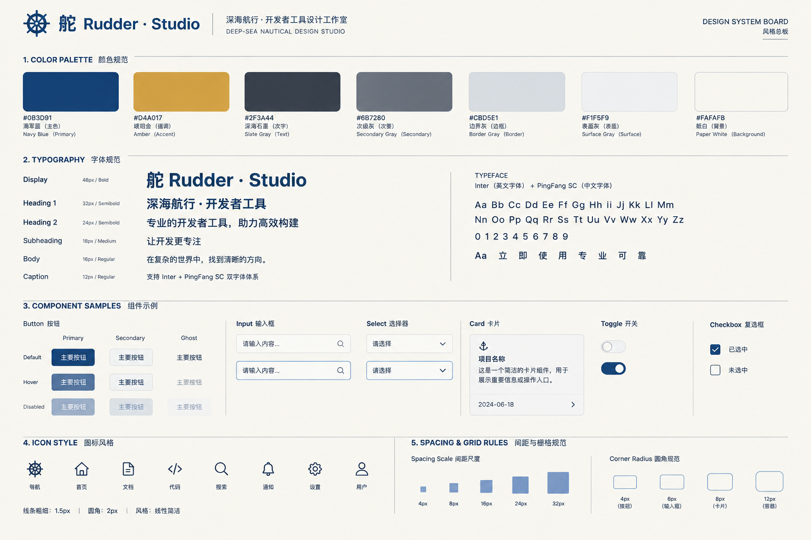

# 舵 Rudder

AI 成套 UI 设计工作室：用 gpt-image-2 把「设计系统总板 → 功能页面 → 组件」一次性生成风格一致的成套界面设计图，并通过 CLI + Skill 供 AI 编码代理驱动。



<p align="center"><sub>自举生成的设计系统总板（锚点图）——本工具界面自身的视觉规范即由它定义（docs/THEME.md）。</sub></p>

## 安装

```bash
# CLI（需 Rust 工具链；~/.cargo/bin 请加入 PATH）
cargo install --path crates/rudder-cli

# 桌面端（macOS aarch64）：下载 .dmg 拖入「应用程序」即可
# （随 Release 提供 Rudder_0.1.0_aarch64.dmg）
```

凭证（解析优先级：环境变量 → OS 钥匙串，绝不写入普通文件/日志）：

```bash
export OPENAI_API_KEY="<你的服务凭证>"   # gpt-image-2 服务凭证（环境变量优先）
export OPENAI_BASE_URL="https://"       # 可选，默认 https://api.openai.com
```

没有 shell 环境（如 Dock 启动的桌面端）时，可在应用「设置」中把密钥保存到
系统钥匙串，或用 CLI 管道写入：

```bash
echo "<你的服务凭证>" | rudder config set api-key   # 写入 macOS 钥匙串
rudder config test                                  # 校验 base / 密钥来源 / 可用模型数
```

## CLI 快速上手

```bash
rudder init "远洋航运 SaaS" --size web --brief "远洋航海行业，克制专业的工具感" --dir ./design
rudder board generate --n 3 --quality low --yes     # 总板候选（先 low 探索）
rudder board pick 0002                              # 选一张设为锚点
rudder page add dashboard --brief "顶部 KPI 卡x4，中部折线图区，右侧任务列表"
rudder page generate dashboard --n 2 --quality low --yes
rudder page pick dashboard 0001                     # 候选转正
rudder component add button-set --type buttons --brief "primary/secondary/ghost 三态"
rudder component generate button-set --quality low --yes
rudder export --out ./design-export                 # 锚点+主稿+manifest+PROMPTS
```

- 不带 `--yes` 一律 dry-run（只出请求计划，零花费）。
- 探索用 `--quality low`（默认档），终版显式 `--quality high`。
- 改简报用 `rudder page update` / `rudder project update`，不必手编 `project.json`。
- 每个批次自动记录 `seed`，凭 `--seed` 可复现或升规格重掷。
- 完整命令参考：`skill/rudder-design/references/cli.md`。

## AI 代理 Skill

把 `skill/rudder-design/` 装进你的编码代理（Codex / Claude Code 等）即可让它自主完成设计产出：SKILL.md 定义「前置检查 → 总板锚点 → 页面 → 组件 → 导出与 DESIGN.md 契约」四步工作流，硬规则内置成本纪律（`--dry-run` 探索、`low` 起步、`high` 终版 ≤2-3 张）。见 `skill/rudder-design/SKILL.md`。

## 桌面端开发

```bash
pnpm install && pnpm dev          # 浏览器预览（无 Tauri 壳）
pnpm tauri dev                    # 桌面端开发模式
pnpm build                        # 前端类型检查 + 产物构建
cargo test --workspace            # Rust 单元与集成测试
pnpm tauri build                  # 打包 macOS .app/.dmg
```

## 文档索引

| 文档 | 内容 |
|---|---|
| [docs/PRD.md](docs/PRD.md) | 产品需求：做什么、不做什么、验收口径 |
| [docs/ARCHITECTURE.md](docs/ARCHITECTURE.md) | 目录结构、数据模型、CLI 命令集、错误码 |
| [docs/THEME.md](docs/THEME.md) | 舵主题视觉规范（色板/字阶/圆角/组件姿态） |
| [docs/PLAN.md](docs/PLAN.md) | Phase 划分与验收规则 |
| [docs/UI-REVIEW.md](docs/UI-REVIEW.md) | 自举实测评审清单与 Phase 5 裁决 |
| [docs/CHANGELOG.md](CHANGELOG.md) | 版本变更记录 |
| [skill/rudder-design/SKILL.md](skill/rudder-design/SKILL.md) | AI 代理 Skill 使用说明 |

## 目录结构

```
ui-designer/
├── src/                     # React 前端（Tauri 桌面应用）
├── src-tauri/               # Tauri 2 壳（薄壳，业务在 core）
├── crates/
│   ├── rudder-core/         # 核心库：项目存储、提示词引擎、gpt-image-2 客户端、导出
│   └── rudder-cli/          # CLI（bin 名：rudder）
├── skill/rudder-design/     # AI 代理 Skill 包
├── design-assets/           # 自举生成的设计资产（总板/页面/组件）
├── scripts/                 # 工程辅助脚本（硬编码文案/i18n 键校验）
├── docs/                    # PRD / 架构 / 主题 / 计划 / 评审
└── e2e/                     # 端到端验收脚本
```

## 许可

[MIT](LICENSE) © Rudder Contributors
